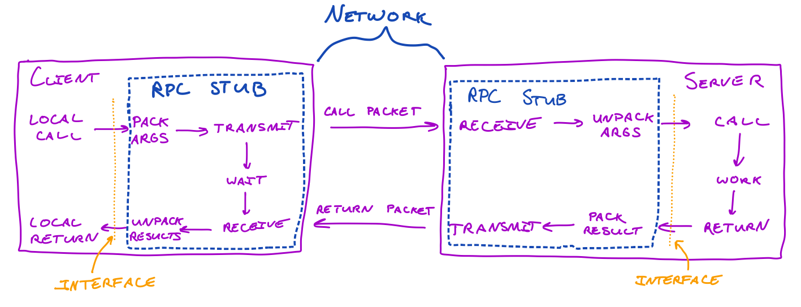

# kubeRPC

**kubeRPC** is a **Kubernetes-native remote procedure call (RPC) framework** designed to enable seamless and low-latency communication between microservices deployed within the same Kubernetes cluster.

## **Why kubeRPC?**

One of the challenges when transitioning from a monolithic architecture to microservices is **latency**. In a monolith, methods (e.g., `generateInvoice`) can be called directly with negligible network overhead. In contrast, microservices require exposing APIs (HTTP, GraphQL, etc.) these add significant latency and complexity to otherwise simple method calls.

**kubeRPC** allows microservices to directly call each other's methods without relying on traditional API endpoints. This drastically reduces latency, simplifies communication, and preserves the speed of direct method calls.

<div style="text-align: center;">
  
</div>

---

## **How kubeRPC Works**

1. kubeRPC deploys a **core service** within your Kubernetes cluster (written in Go) that acts as the central orchestrator.
2. kubeRPC **watches for all services** in the namespace and automatically registers their DNS names and other relevant metadata.
3. Microservices can **register callable methods** with the kubeRPC core service.
4. Other microservices can invoke these methods using the kubeRPC SDK, eliminating the need for HTTP or similar overhead.

---

## **Setup and Deployment**

### **Requirements**

- A Kubernetes cluster (any version compatible with Helm).
- Helm installed on your local machine.

### **Deploying kubeRPC**

kubeRPC can be deployed using a helm chart.

```bash
helm upgrade --install kuberpc-core \
  oci://ghcr.io/darksuei/charts/kuberpc-core \
  --version 1.0.0 \
  -n kuberpc \
  --create-namespace \
  --wait
```

---

## **Usage**

### **Registering Methods**

To register methods, services must interact with the kubeRPC core using the kubeRPC SDK.

### **Calling Methods**

Once methods are registered, other services can directly invoke these methods using the SDK.

---

## **Available SDKs**

Currently, a **TypeScript SDK** is available:

- TypeScript SDK: [Source code](https://github.com/darksuei/kubeRPC-sdk) | [NPM](https://www.npmjs.com/package/kuberpc-sdk)

We welcome contributions for SDKs in other programming languages!

---

## **Contributing**

We encourage developers to contribute by:

1. Building SDKs for other languages.
2. Reporting bugs or requesting features via GitHub issues.
3. Submitting pull requests to improve the core or SDKs.

Check out the [Contribution Guide](#N/A) for more details.
